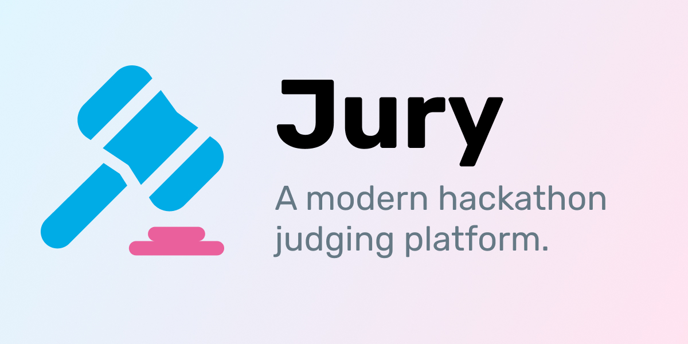

# Jury

A project designed to create a new pairwise judging system using modern technologies, aimed at optimizing the user experience of judges, hackers, and organizers. See the inspiration for this project: [Gavel by anishathalye](https://github.com/anishathalye/gavel). This project uses an individual ranking and rank aggregation system to automate the judging process and help organizers get more data from less judges to decide the winners of your hackathon.

To get started, check out the [intro guide](./docs/docs/intro.md).

# Contributing

Check out [our contributing docs](/CONTRIBUTING.md).
