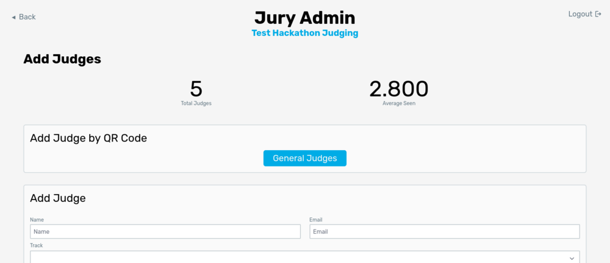

# Adding Judges

Just like accessing the [Add Projects](/docs/usage/admin/add-projects) page, go to the "Judges" tab on the admin dashboard and click the **Add Judges** button.

There are also 3 ways to add judges to Jury, but we recommend using the QR code method. You may also add judges individually or through a CSV upload.

## QR Code

The easiest way to add judges to Jury is using the QR code. This method works best with a dedicated **judging orientation** during your hackathon. During a judging orientation, judges will gather in a room and organizers will explain how judging will work (explain the expo-style, criteria for judging projects, and answer any questions they have). With Jury, you should also add judges to the system at this time. With all the judges in one room, the easiest way to add them is by showing a QR code on the screen. Once judges scan this QR code, they can add themselves to the system (by entering their name and email).

This is convenient for the organizers as you won't need to manually add them to Jury. As judges add themselves, you should check to make sure they are registered judges (by looking at the admin dashboard). Once they fill out their name and email, judges will be sent an email with a link for them to start judging. Judges won't be able to see projects until you start judging, so you may add them to the system at any time.

:::danger[Watch out!]
Keep in mind that the QR code will let **anyone add themselves to Jury**, so make sure stray hackers don't get the QR code! If your QR code gets leaked, you can use the **Generate new code** button on the QR code page to change the QR code. Note that anyone who has scanned the code but have yet to add themselves to the system will have to scan the new code.
:::

### Track QR Code

Track judges can also be added by their own QR code. When [track judging](/docs/usage/admin/tracks) is enabled, a dropdown will show up with each track that is listed. Select the track you would like add judges to and click the **[Track name] Track Judges** button.

It will generate a different QR code for that track, which will be clearly noted by the title above the QR code.

## Add Judge Form

The add judge form is the same as the add projects form (except simpler). Enter the judge's name and email (and optionally a note about the judge) then click **Add**. It will send an email to the judge to add them to the system. If you do not wish to send an email, make sure "Do not send an email" is checked. Judges can log in without an email by going to Jury, opening the judge login page, and entering their code (see the admin dashboard for their code once added).

## CSV Upload

You can upload a CSV of all judges in the same as [adding project by CSV](/docs/usage/admin/add-projects#csv-upload). The fields are as following:

- Name
- Email
- Track (optional)
- Notes (optional)

You may check "Do not send an email" if you do not wish to send emails to all judges added by CSV. Note that email sending might be slow for a lot of judges added at once through CSV.
