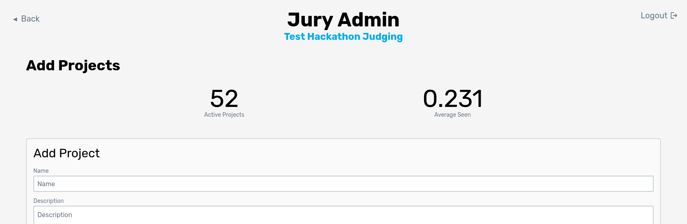

# Adding Projects

Before any judging can be done, the projects need to be added to Jury. Go to the admin dashboard, switch to the projects tab, and click "Add Projects". You should be directed to a page that looks like the following.

There are currently 3 ways to add projects to Jury: adding a single project through the form, uploading a CSV, and uploading an export CSV from Devpost.

## Add Project Form

This form is pretty straightforward and covers the required fields needed to add a project to Jury. You only need to provide a name, description, and project URL. All other fields are optional, but the challenge list is needed to enable Jury to do [track judging](/docs/usage/admin/tracks).

## CSV Upload

You may also choose to upload a CSV of all projects. This is used if you have a project submission portal that is not Devpost. Each line should contain the following comma-separated values:

- Name
- Description
- Project URL
- "Try It" link
- Video link
- Comma separated challenge list (in quotes)

## Devpost Upload

For hackathons that use Devpost, you may simply upload the CSV of projects exported from Devpost. To obtain this CSV, go to your hackathon’s **manage page** on Devpost. On that page, you should see a tab labeled **Metrics**. Click this tab and you should see an option to download the CSV. Make sure you do NOT include personal information as its unnecessary for Jury. See the image below for reference. Click the **Generate Report** button. Devpost will refresh the page and show a download link after a few moments (may take longer for bigger events).

Once you have the CSV downloaded, go back into Jury and upload the CSV. It should correctly import all projects into Jury!

:::tip
Devpost includes projects that are still drafts (haven't been submitted), but Jury automatically ignores them when importing the CSV.
:::
