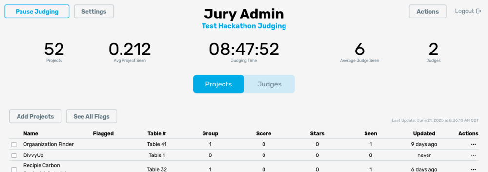
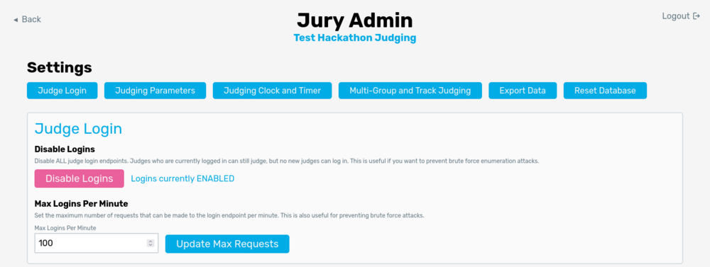

# Configuration and Settings

## Logging In
Once you have Jury up and running, make sure everything is working by logging into the admin portal. Use the admin password that you set in the environmental variables when setting up Jury. Once in the portal, you should see the admin dashboard shown below (though without any projects or judging progress):

Make sure where it shows “Test Hackathon Judging” on the picture is replaced by the name you set under `VITE_JURY_NAME` environmental variable.

On the dashboard, you should see a button at the top labeled **Settings**. This is where we will go to configure everything for Jury. Click it now.

## Settings

The settings page should look like the following:

All settings will have a description describing their functionality, but we will go through each section one-by-one here for completeness.

### Judge Login

This section is mainly for after judging has started. Due to an experience with a brute-force login attack (due to the nature of judge codes), we have implemented a rate-limiting and login disabling system. The first button is used to disable logins. Once a judge is logged in, they can continue judging even if logins are disabled. We recommend **disabling logins once judging has started**.

Another option for mitigating brute force login attacks is to limit the number of logins per minute. This number can be changed at any time during judging, so another idea for preventing this sort of attack is to set the maximum to a low number such as 10 per minute. This allows for a few judges to log in without opening up the possibility for a brute force attack.

### Judging Parameters

Here, we define a couple of the parameters for the judging process. The first two buttons **reassign project numbers** and **reassign judge groups** are pretty self-explanatory. The former will remove table numbers from all projects and re-assign table numbers. This is generally done in the order that projects are added to Jury. Make sure you do NOT do this during judging as it will mess up the judging order! Generally, we use this if we've deleted a lot of projects in Jury and want to fill in the "holes" in tables (eg. you remove table 46 and want to shift all the other tables to fill the gap--this will obviously be bad during judging as it'll move all later tables). If you want to do this during judging (eg. add a new project to an empty table), you can use the "set table number" action on the [dashboard](/docs/usage/admin/dashboard). The **reassign judge groups** is a little complicated and will be explained on the [multi-group judging page](/docs/usage/admin/groups).

**Set Minimum Project Views** allows for you to specify the minimum number of views a project should get. The goal of Jury is to ensure that every project is compared to every other project approximately an equal number of times. However, we want to ensure all projects do get seen at LEAST a couple of times. Until all projects have been seen n times (set by this setting), the projects with the least number of views will be given to the next judge. This ensures that we are prioritizing all low-view projects until passing this threshold. Once past the threshold, the comparison-balancing algorithm will then be used to assign projects to judges.

**Ignore Tracks** is a feature primarily for batch uploading projects. If you have a track that you do NOT want judged with Jury, you can insert tracks that you want Jury to ignore here. When project(s) are uploaded to Jury, any project containing a track in the "Ignore Tracks" list will not be added to Jury. If you want all projects to be added to Jury, this is NOT where tracks to be judged are defined (see [below](#multi-group-and-track-judging)).

### Judging Clock and Timer

**Reset Main Clock** will reset the clock on the admin page--this is handy if you accidentally start the main clock and want to quickly reset it.

**Sync Clock with Database Automatically** is only useful if you have multiple instances of Jury or experience crashes. This will periodically store the main clock time in the database so that if Jury happens to restart the time won't be reset (as it's normally stored in memory).

**Backup Clock** will store the current clock value in the database.

**Set Judging Timer** determines how long each judge has to see a project. Judges will see a timer on their phone for each project, with its length determined by the value you set here. We find that 5 minutes is generally a good length and is defaulted to that.

### Multi-Group and Track Judging

In this section, you can toggle the multi-group judging and track judging options. Track judging allows judges to view only projects from specific tracks and judge them separately from the main judging. Multi-group judging can be used to group judges so they will only be assigned projects in their group, switching groups periodically to minimize walking. More detailed information about how to use track and group judging are on their respective pages:

- [Track Judging](/docs/usage/admin/tracks)
- [Multi-Group Judging](/docs/usage/admin/groups)

### Export Data

This section allows you to export data from Jury as a CSV. There are 4 groupings to export:

- **Export Judges** - Exports all judges
- **Export Projects** - Exports all projects
- **Export Rankings** - Exports only the judges and their individual rankings of projects
- **Export by Challenges** - Exports a zip file, with each CSV file containing only the projects that submitted to a specific challenge; each CSV will be titled with that challenge name

### Reset Database

This button will reset the database. It's pretty destructive, so obviously do not click it unless you are sure you want to COMPLETELY CLEAR Jury!!!
