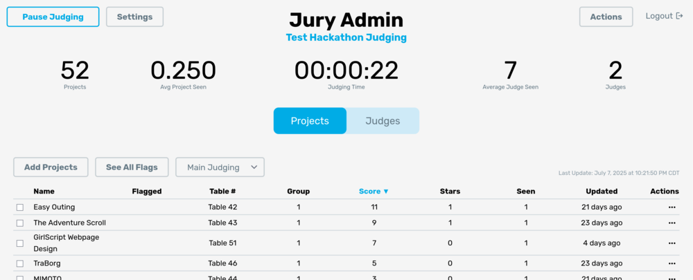
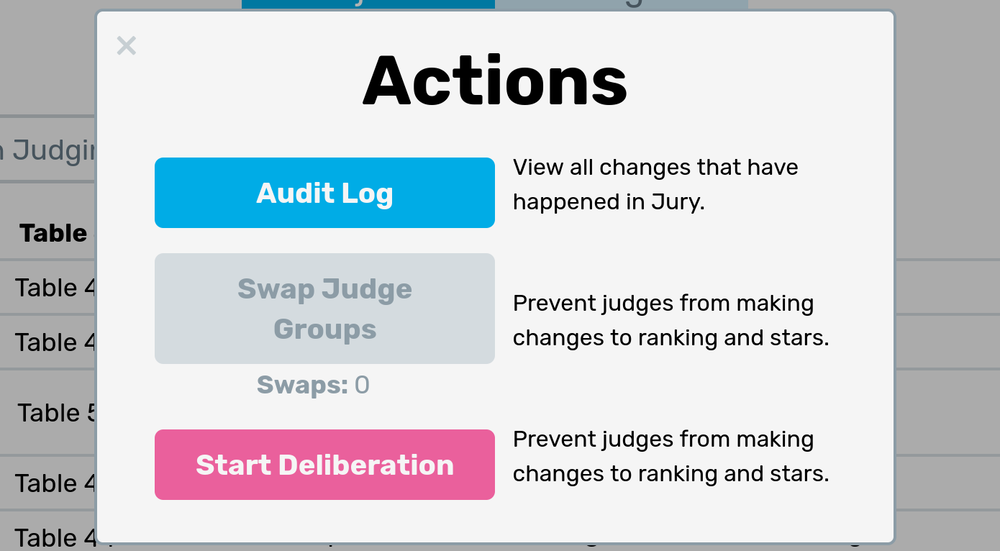
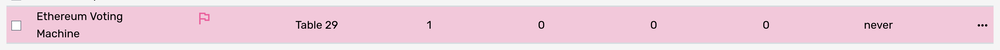
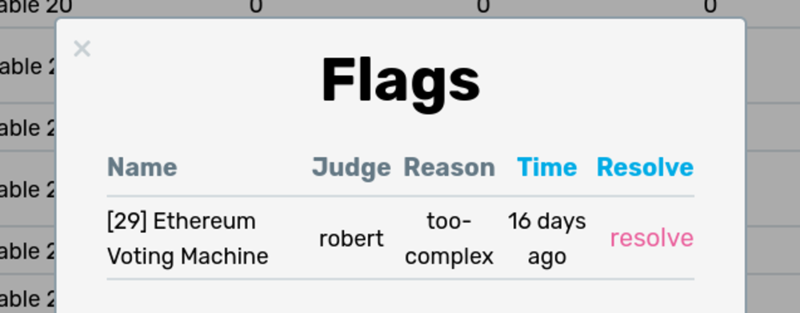
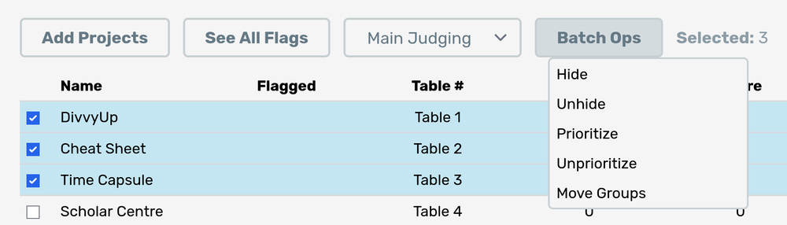

# Admin Dashboard

The admin dashboard is the heart of Jury, a place where admins can see all the judging data in real time.

We will go section by section and list out the key components of the dashboard.

## Pause Judging

The Start/Resume/Pause Judging button is used to stop and start judging. When judging is paused, judges cannot request new projects (though they can finish judging the current project they are viewing). Note that judges are able to change scores and ranks of projects even when judging is paused.

Before the judging period starts, make sure that judging is paused. You may freely do anything such as add new projects, change groupings, set tracks, add new judges, and even reassign all table/group numbers. Once judging does start, you can add new projects and judges, but make sure certain settings such as the groups and tracks are not changed as it will cause inconsistencies in the judging.

## Settings

The settings for all of Jury. Refer to the [Configuration docs](/docs/usage/admin/configuration) for more information about specific settings.

## Admin Actions

Clicking on the **Actions** button will bring up the following popup:

In this popup, there are three main functions. The first is a link to the **audit log**. The audit log lets you see ALL actions that have been taken during the judging period. Basically all actions that are performed are listed here such as:

- Admin login attempts
- Judge login attempts
- Judge sees a project
- Judge changes rankings
- Project gets added
- Admin setting gets changed

The next button, **Swap Judge Groups**, well, does just that. If you set the switching method to `manual` for [multi-group judging](/docs/usage/admin/groups), you will be able to switch all judges to the next group with this button. Next to the button there is a field that indicates the number of times manual switching has happened.

The third button is labeled **Start Deliberation**. By starting deliberation, judges will no longer be able to make changes to their rankings and stars. This is useful for when you want to do judging deliberation and need the rankings to be set. Make sure to warn judges that this will happen and encourage them to rank their projects as they judge them (it gives admins more information during judging and ensures they don't forget projects when ranking).

## Statistics

At the top of the page, there is a row of aggregated statistics for admins. Here are the listed fields:

- **Projects**: Number of active projects (not hidden).
- **Average Project Seen**: This is the number of times a project has been seen on average. You should aim to have this above a certain number (normally at least 3-5).
- **Judging Time**: The total amount of time elapsed for judging.
- **Average Judge Seen**: Average number of projects a judge has seen. This should also be a decently high number (eg. if judging for 2 hours and judge spends 6 mins/project, then this number should be around 15-20).
- **Judges**: Number of active judges (not hidden).

## Table Switcher

The main tab switcher allows you to switch between the table of projects and the table of judges.

## Projects/Judges Tables

Both tables are very similar, except they display different columns of information. The actions generally are the same between the two tables.

### Add Projects/Judges

This button will change based on the table displayed. See the [add projects page](/docs/usage/admin/add-projects) and [add judges page](/docs/usage/admin/add-judges) to see the different ways to add projects and judges to Jury.

### See All Flags

This button is only avaliable when viewing projects. This popup lets you see the flags for all projects in Jury. See the [flagged project](#flagged-project) section below for more information about flags and what the popup looks like.

### Last Updated

The admin dashboard will automatically refresh **every 15 seconds**. The last update time will be shown on the top right of the admin table. You will not need to automatically refresh the page to get new information. The time should be in your local timezone.

### Project/Judge Rows

In each row, you can see a single project or judge. Projects' titles will be hyperlinked with their `url`, which can be clicked to go to the linked project. The **Updated** column shows the last time a project/judge was modified. For projects, this means when they were seen and for judges this means the last time they ranked/viewed a project.

The **actions menu** on the right side of each row allows you to perform actions on that specific judge. You may also select multiple projects/judges to perform these operations on [multiple projects/judges](#batch-operations). Here are the actions:

- **Edit**: Opens a popup to edit the project/judge
- **Hide**: Disables the project/judge. Disabled projects cannot be seen by judges but can still be ranked. Disabled judges cannot judge and will see a notice that they've been disabled if they try to judge. It is recommend you **hide rather than delete** as it will be less destructive but prevents that project/judge from affecting judging.
- **Prioritize**: (Projects only) Allows you to prioritize a project, sending the next avaliable judge (in the same [group](/docs/usage/admin/groups)) to that project. This may be used if a project hasn't been seen enough.
- **Move Group**: Moves the project/judge to another group. Keep in mind moving a project to a new group would likely need to have them change physical location, so be cautious doing this during judging. Moving judges to another group can be done freely during judging but may require that judge to walk more. You cannot move a project to another group if that group is full.
- **Scores**: (Judges only) View all rankings and stars for the judge.
- **Delete**: Deletes the judge/project. DO NOT DELETE PROJECTS DURING JUDGING. Instead, hide the project. Deleting judges during judging is not necessarily bad to the system but may upset the judge who you delete.

### Flagged Project

When a judge flags a project, it will show up on the admin dashboard as a red flag on the project's row. Clicking on the flag icon will open the flag popup:

This popup will let you see which judge flagged the project, the reason for flagging, and an option to resolve the flag. Resolved flags will disappear from the admin dashboard.

:::info
Note that if the reason is `absent`, projects will be **automatically hidden** after 3 absent flags. This is to prevent Jury from constantly sending judges to a project. You should make sure any hidden projects are actually absent--simply unhide them if hidden improperly and judges will be sent to that project.
:::

### Batch Operations

When at least one project/judge is selected using the checkbox on the very left of each row, the batch operations menu appears in the table toolbar. These options closely mirror the options in the actions dropdown, except it will modify all selected rows.

