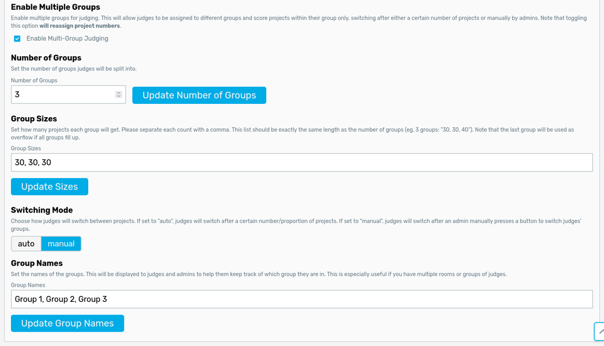
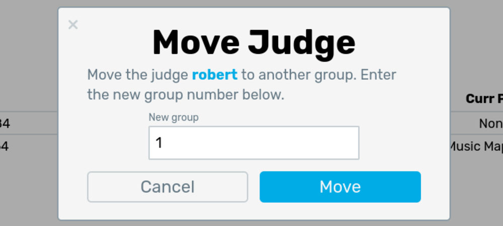

# Judging with Multiple Groups

This is arguably the most complex feature in Jury, and it should only be used if you have a larger hackathon where projects are split up among rooms that are relatively far apart (ie. it would take a judge more than like 30 seconds to walk between rooms). If this applies to you, we have added a feature that allows for judges to stay in a room or area for a couple of projects before having to change rooms. This decreases their walking time while still maintaining fairness in the judging algorithm.

## Setup

To set up multi-group judging, toggle it in the settings:

:::warning
Same as with tracks, toggling multi-group judging on/off during judging is a BAD idea (ie. don't do it!!)
:::

### Number and Size of Groups

The first option is to set the **number of groups**. This determines how many groups projects will be split into. The next option is a comma-separated list of the **sizes of each group**. Note that projects will be assigned to groups starting from the first, so make sure you do not create too many groups! Changing the sizes or number of groups will automatically update the group numbers of projects, so feel free to keep changing this to match your room setup during judging setup. This is again probably not a good idea during judging. 

### Switching Modes

There are 2 methods of switching judges between groups. We want to switch judges occasionally otherwise they would see an uneven number of projects from one group. 

1. The first and most common method is `auto`. This is used if you want to automatically switch between rooms after a **proportion** of projects from a room has been seen (eg. 10% of 30 projects in a room means a judge sees 3 projects then moves to the next room). This is a proportion not a single value due to rooms having different number of projects.
2. The more uncommon method is `manual`. A button will show up on the dashboard actions that will allow you to manually switch groups. One use case of manually switching is during [HackUTD 2024](https://ripple.hackutd.co), where we had two buildings for judging. We didn't want judges going between the different buildings too much, so we made 2 big groups. Each building consisted of a group, and halfway through judging we told everyone to switch buildings. This ensures that both buildings' projects are evenly compared while preventing judges from having to walk too much.

### Group Names

Although mostly cosmetic, the group names are displayed in the project expo page. The group names can be seen when you print out the expo page and help hackers easily identify where they need to go. Make sure this list is the same length as the number of groups.

## Assigning Judges to Groups

Judge groups will be assigned **automatically** in a round-robin fashion as you add judges to the system. If for any reason the number of judges in a group is uneven, you can either manually move a single judge using the **Move Group** action in the admin table:

Or, you can click the "reassign groups" to reassign ALL judge groups. This *can* be done during judging as it will just shuffle around judges a bit to new groups; however, try to avoid this as much as possible! It is also not advised to reassign groups mid-judging if using the manual switching method as it may mess up the judging ratios!

