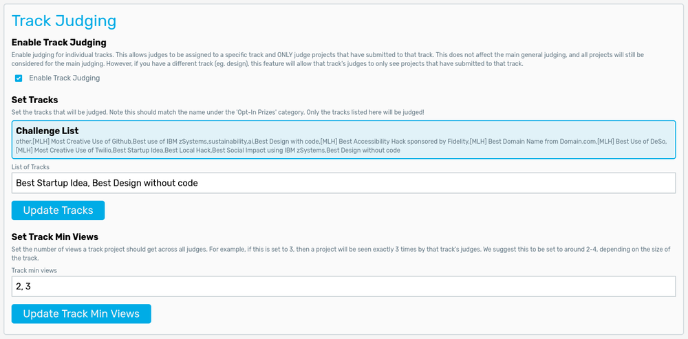

# Judging Tracks (Challenges)

Tracks are generally smaller prizes within a hackathon that hackers can compete in, on top of competing for the general prize. To facilitate track judging, there are a couple of features within Jury that allow judges to give their opinions on tracks.

## Track Setup

On the admin settings page, there is a section dedicated to tracks:

The first checkbox is used to enable/disable tracks. Disabling tracks will hide all track-related features, including adding judges by tracks and the track dropdown for the admin dashboard.

:::warning
Make sure you do NOT toggle this on/off during judging as it may result in unexpected behavior when assigning/judging projects for track-specific judges!
:::

The main setting that will need to be set is the list of tracks to judge. Once all projects are uploaded into Jury, the set of all tracks will be displayed in the **Challenge List** section (will not display if no projects or no projects have any items in the `challenge_list` field). In the **List of Tracks** input box, please list all tracks that you would like to be judged by Jury. This will allow you to add judges that ONLY see projects for that track. Note that tracks must be written **exactly as shown** in the Challenge List, including capitalization. To ensure your tracks are correct, you can check on the admin dashboard to see if all the tracks you've listed contain projects.

You may also set the number of views each project gets per track. This is useful for smaller tracks to have projects viewed more times while larger tracks or less judges means you need to reduce the number of views per project to finish judging in time. Generally we recommend 2-4 views per project. Note that the track views list needs to be the same length as the track name list.

## Adding Track Judges

To add track-specific judges to Jury, you can use any of the three methods listed in the [Adding Judges](/docs/usage/admin/add-judges) page. For the CSV upload and form methods, simply fill in the track field with the track that you would like the judge to judge. The form will have a dropdown, but the CSV will need to have the track filled in with the **exact spelling and capitalization** of the track.

To add a track judge by QR code, an [additional dropdown](/docs/usage/admin/add-judges#track-qr-code) will appear on the **Add Judges** page, which will let you view and generate QR codes for each track.

## Judging Tracks

Track judging is simpler than the main judging on purpose. All projects will be viewed exactly the number of times set in the **Track Views** setting, with judges only able to [star](/docs/usage/admin/scoring#starring) projects. The reason for this simplification is because tracks generally have a lot less projects than main judging, and Jury simply allows a random distribution of projects to be given to track judges. Track judges should get together after viewing all their assigned projects from the track and decide on a winner, focusing on the projects that are starred more.
