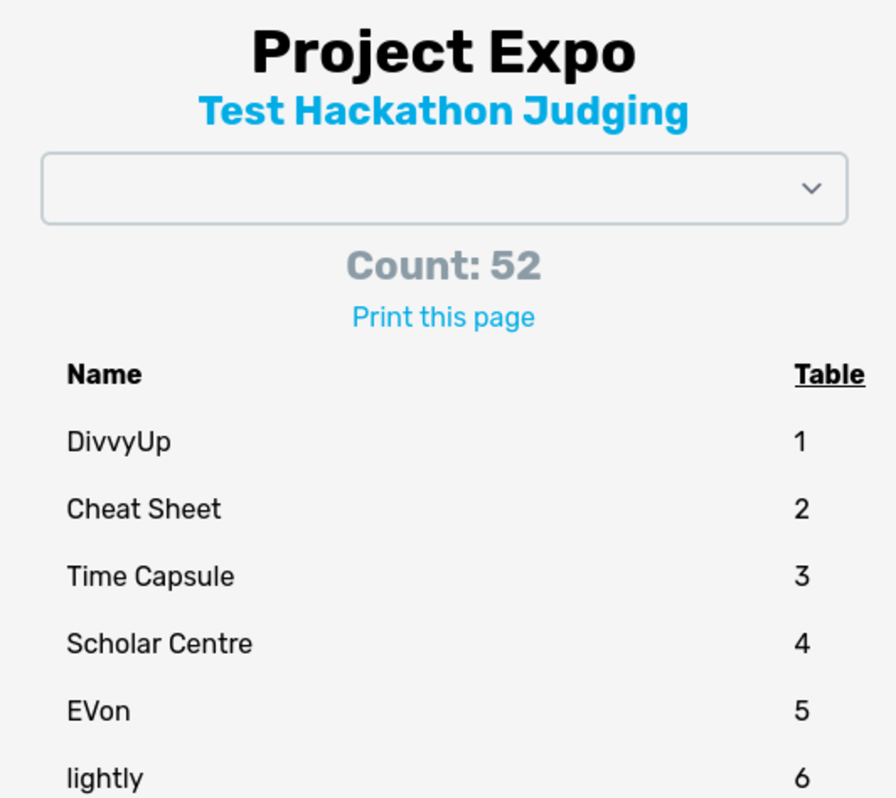

# Project Expo

The project expo page is the public project list, showing all projects with their table numbers and [groups](/docs/usage/admin/groups) (if enabled):

Clicking on the headers will sort by table number or name (alphabetically). You can click on the names of each project to go to the linked `url` of the project.

The dropdown at the top lets you select which track to view. Note that ALL tracks will be listed here, not only the ones that are going to be judged by Jury. 

Click on **Print this page** to get a printable view of the page. Note that the selected track will be displayed on the print page as well.
