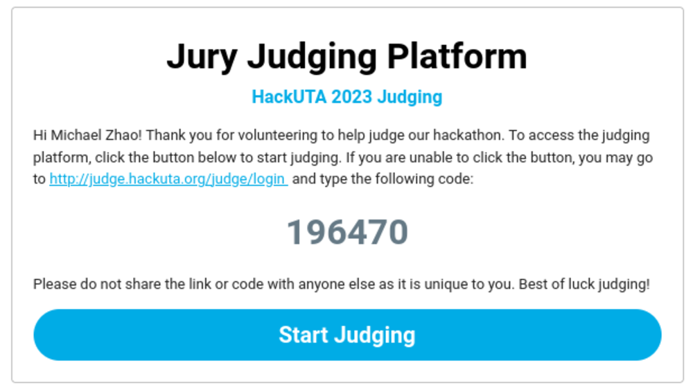
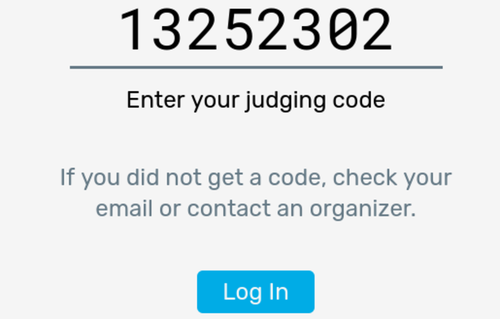
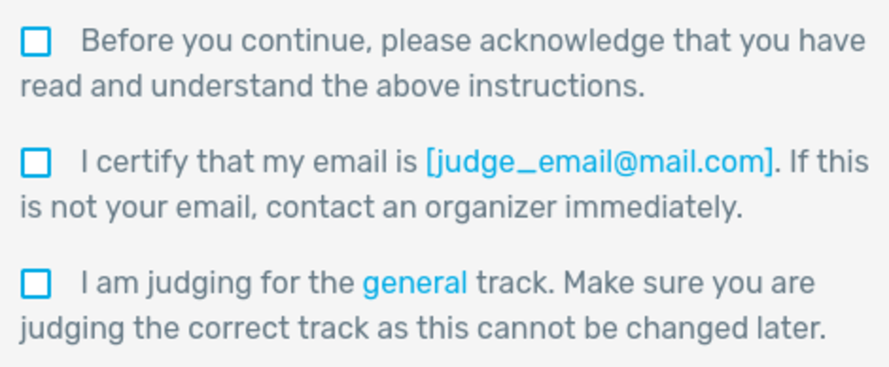
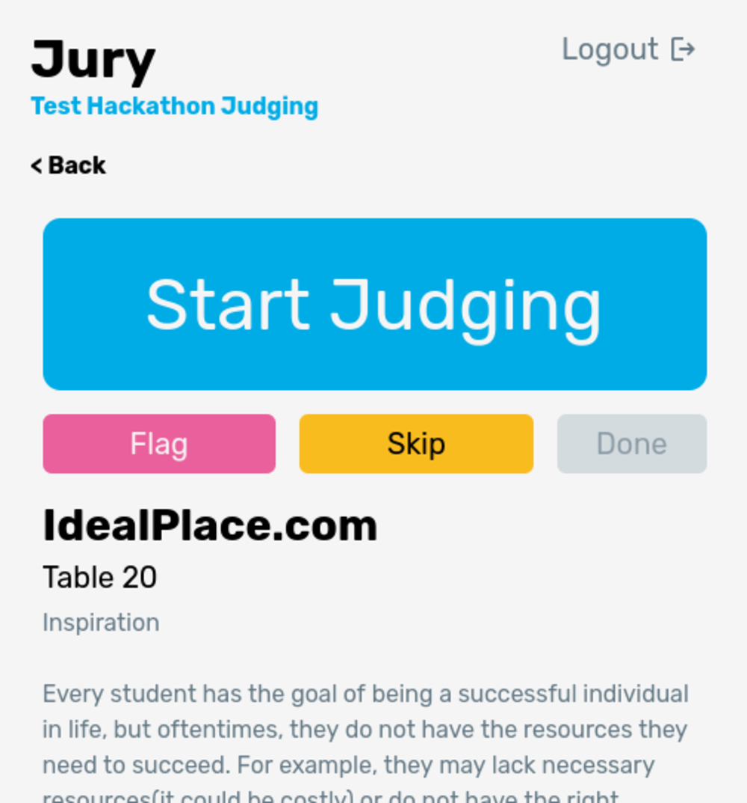

# Judge Interface

Jury is designed to be as easy as possible for judges. It provides for a seamless and easy-to-use judging interface, from initial onboarding to ranking projects. This page will outline the process that judges go through and aim to answer any questions judges might have about the system.

## Initial Onboarding

When judges are [added to the system](/docs/usage/admin/add-judges), they will recieve an email with the subject line **Jury Judging Platform [VITE_JURY_NAME env]** and should look like the following:

Pressing the button on the email brings the judge to the login page, with the code automatically filled in. If the button does not work, the judge can also manually go to the login page (either with the link on the email or given by the organizers) and enter the code that is shown on the email. The login box looks like the following:

Click the login button to start judging. The judge will be taken to a **welcome page**. This welcome page gives a brief summary of how judging on Jury will work and provide a few checkboxes for judges to check:

The most important points are for judges to check that their **email** and **track** are correct. If they have the wrong email or track, their results could create inconsistencies with the judging and audit systems. Confirming these checkboxes and continuing brings them to their main judging dashboard. Note that judges will not be shown that welcome screen on subsequent logins.

## Judging Dashboard

The first time a judge sees the dashboard they will not have any projects. Simply tell them to click the **Next Project** button and proceed to the [live judging page](#judging-projects).

Once judges have seen projects, they will show up on the dashboard in the "seen projects" section:

Judges can drag and drop projects from the "Unranked Projects" section into the "Ranked Projects" section. When dragging and dropping the projects, they will be able to see the ranking placement of the project:

Note that judges can also star projects from this screen. Projects' titles, location, and judge personal notes are shown on this screen, as well as if they starred the project. If they click on a project title, they will be taken to the project summary screen. On this screen, judges can see the description of the projects as well as update the star status and their personal notes about the project.

## Judging Projects

Once **Next Project** is clicked on the judge dashboard, they will be taken to their next project. Judges will see the project name and table number. They will proceed to that table number to start judging.

:::note
If judging is paused, judges will see a notice on this page (instead of a project) explaining to them that judging is paused.
:::

Once the judge has gotten to the table, they should click the big **Start Judging** button. This will start a timer (set in the [admin settings](/docs/usage/admin/configuration#judging-clock-and-timer)) that counts down. Judges may set this on the table to show participants how much time they have left. When the timer runs out, it will sound an alarm--make sure to tell judges to turn up their sound to hear this alarm!

Once the group has finished presenting their project, click the **Done** button. This will bring up a popup that lets the judge finish their notes, as well as star the project if they thought the project was especially good. Clicking **Submit** will return the judge back to the [judging dashboard](#judging-dashboard).

If the judge approaches a table and either the group is *absent* or is *busy* with another judge, they can click the **Skip** button to skip the project with one of those reasons. If a project is skipped for being absent **three times**, the project is automatically hidden. The project will be given a flag **Hidden due to Absent** that can be seen on the admin dashboard. Organizers should confirm the project's absence when this flag shows up. Also note that skipping a project because it is busy/absent does NOT affect the project's score in any way. Jury should not assign more than one judge to a project, but other judges such as sponsor judges may be occupying a project. Skipped projects will be assigned to another judge eventually, so make sure judges are comfortable skipping projects so they aren't waiting on a project for too long.

The **Flag** button lets the judge notify admins if they believe a project is unfit to be judged. This can be for one of three reasons:

1. **Cannot Demo Project**: The teams seems to struggle to demo their project, almost as if they didn't make it themselves.
2. **Too Complex**: The project seems way too complex to make during the time span of the hackathon (within 24 or 36 hours).
3. **Offensive Project**: If the project breaks the code of conduct or is offensive in any way, it should not be considered for a prize.

Judges shouldn't have to flag projects often, and you should always send an organizer to verify a flagged project. Note that "absent" also shows up as a flag in the admin dashboard but will be automatically removed if 3 absent flags appear.

## Continuing Judging

Once judges finish viewing a project, instruct them to rank the project among the other projects they've seen. If they want to take a break at any point, they can do so freely simply by not requesting another project to view. We ask judges to finish judging the project they are on before taking a break as **when judges are assigned a project, no other judge can see that project**! To get to their next project, they simply click the **Next Project** button at the top.

:::tip
It helps organizers greatly if judges rank immediately after seeing a project--organizers can see which projects are leading and can start considering winners/checking for cheating ahead of time.
:::

Tell judges to continue judging until judging ends or they've gone through all the projects.
