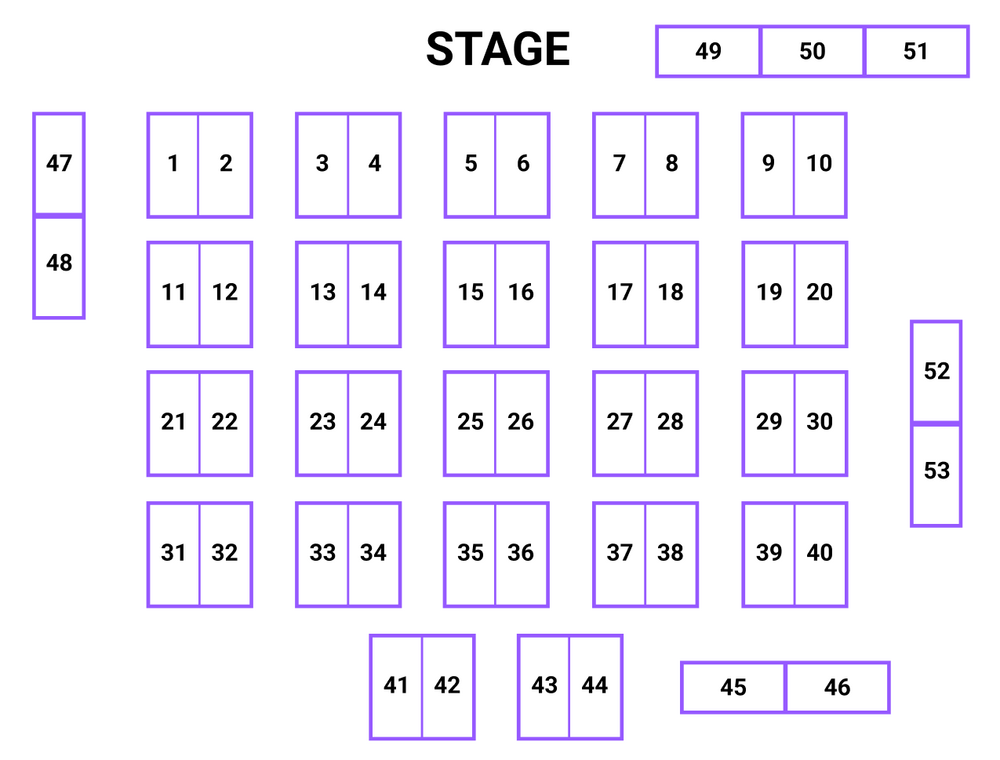

# Physical Judging Setup

Judging with Jury is done in an [**expo style**](https://www.millertanner.com/what-is-an-expo-event/). Think science fair or any expo-style conference that you've gone to. Essentially, all projects will get a table or booth and stay there for the duration of judging. In that time, judges will walk around and view projects by walking to them.

The setup for an expo style event generally includes booths (most likely just tables or classrooms) where each team will be assigned a table to stand at. Here's an example of a map of tables at an event:

Jury will automatically assign projects to a table number, so you just need to make sure to have as many tables as projects. If you don't have enough tables, you can simply add more tables as you add projects.

## Judging Timeline

| Time     | Event                  | Description                                                                                      |
| -------- | ---------------------- | ------------------------------------------------------------------------------------------------ |
| 11:00 am | Judging Setup          | Set up judging tables ahead of time                                                              |
| 11:30 am | Judge Check-in         | Give judges 30 mins to arrive and check in                                                       |
| 12:00 pm | Projects Due           | Hackers should submit projects by now!                                                           |
| 12:00 pm | Judging Orientation    | Walk through Jury and explain to judges how to use the software                                  |
| 12:00 pm | Add Projects to Jury   | Add all projects to Jury, making sure everything looks right, then release project table numbers |
| 12:30 pm | Add Judges to Jury     | Add all judges to Jury and move them to the judging room                                         |
| 12:30 pm | Move hackers to tables | Send out the tables to hackers and make sure they are set up                                     |
| 1:00 pm  | Judging!               | This can last anywhere between 1-3 hours, depending on project to judge ratio.                   |
